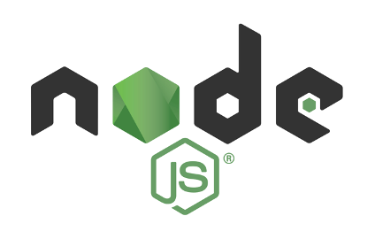
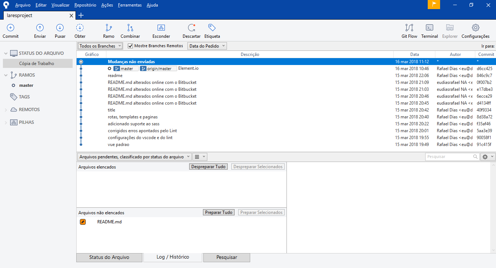
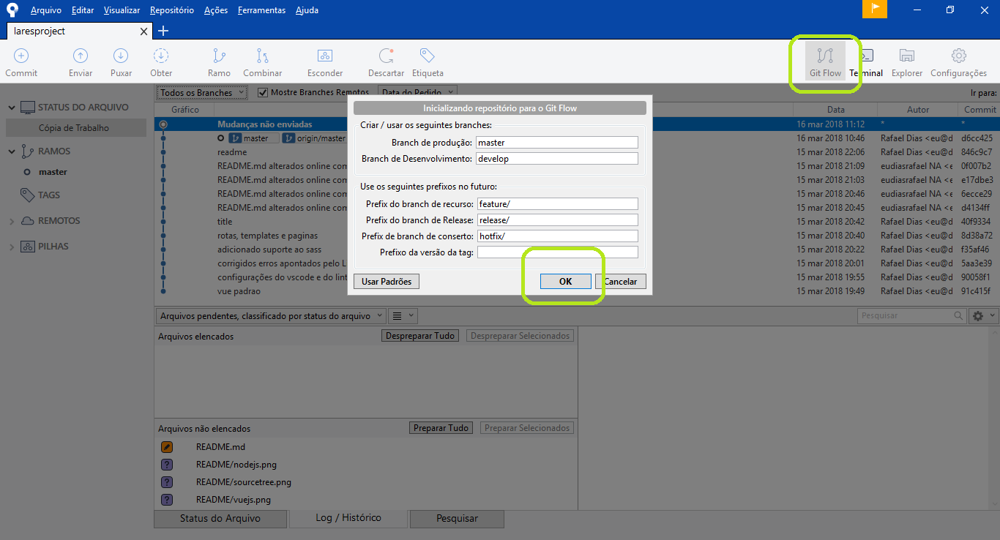
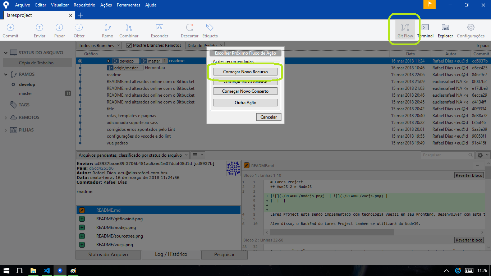
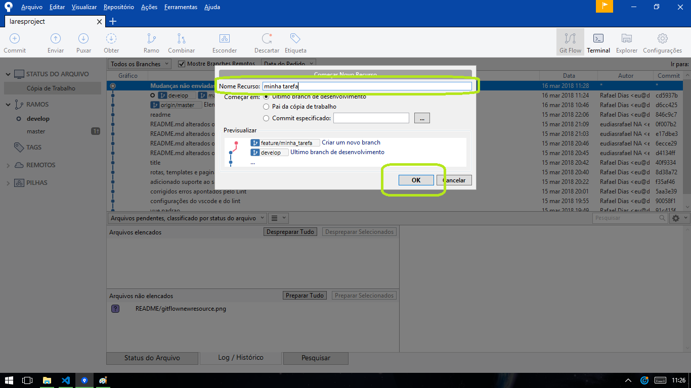
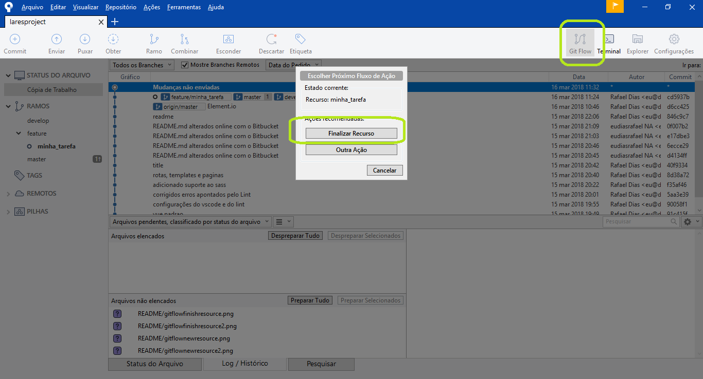
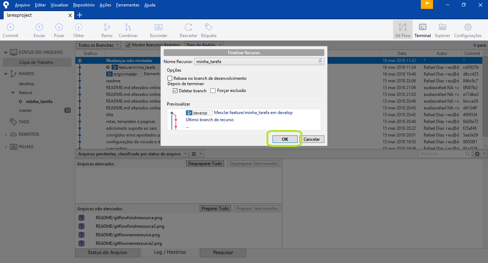

# Lares Project
## VueJS 2 e NodeJS

Lares Project esta sendo implementado com tecnologia VueJs2 em seu FrontEnd, para desenvolver com esta tecnologia é necessário ter instalado o NodeJS e VueJs2.

Além disso, o BackEnd do Lares Project também se utilizará do NodeJS.

[Download do NodeJS](https://nodejs.org/en/) - Após baixar, basta executar e dar next, next, next, install. Não se preocupe com possíveis opções.

Uma vez tendo instalado o NodeJS, abra a linha de comando (feche e abre ela caso tenha estado aberta durante a instalação do NodeJS) e execute o seguinte comando:

    npm install --global vue

Este comando do gerenciador de pacotes do NodeJS irá baixar e instalar o VueJS 2 de forma global em seu computador.

Para saber mais sobre o gerenciador de pacotes do NodeJS, [assista este meu vídeo no YouTube](https://www.youtube.com/watch?v=WZoVzdi3N9s&t=186s).

## Dependências
O projeto possuirá dependências de terceiros, é uma má pratica deixar todas essas dependências versionadas em seu próprio projeto.

Ao invés disso, podemos deixar o NPM cuidar da instalação e atualização de todas as dependências.

Todas as dependências de produção e desenvolvimento ficam listadas no arquivo ./packages.json.

Para instalar (ou atualizar) todas as dependências basta executar o seguinte comando na linha de comando dentro do diretório do projeto:

    npm install

Simples, não? Não se esqueça de executar este comando sempre que baixar atualizações do projeto ou de mudar de Branch no GIT, isso porque dependências podem ter sido adicionadas, atualizadas ou removidas. Deixe o NPM cuidar disso para você!

## Element.io

O projeto já vem com o Element já devidamente instalado e configurado, bastando utilizar!

Element é um framework de interfaces 100% compatível com o VueJS 2, provendo uma infinidade de recursos, tais como:

- Divisão de layout em linhas e colunas com uso de componentes e atributos, ao invés de atribuir classes a divs;
- Responsividade;
- Uma quantidade enorme de campos de formulário personalizáveis;
- Design moderno;

E muito mais... [clique aqui para acessar a documentação completa](http://element.eleme.io/#/en-US/component/) do Element.

## Executando o Projeto em Desenvolvimento

Para ver como o projeto esta ficando execute o seguinte comando na linha de comando dentro do diretório do projeto:

    npm run dev

O servidor NodeJS do VueJS irá transpilar, compilar, minificar e modular os arquivos da melhor maneira possível e criá-los **em memória** para serem executados no servidor.

Para ver o projeto funcionando, bastará acessar o endereço http://localhost:8080.

Note que toda alteração salva no projeto é imediatamente refletida no navegador sem necessidade de atualizações, porém é bom ficar de olho na linha de comando para verificar possíveis erros que possam vir a ser disparados (por erro de código ou mesmo más-práticas de desenvolvimento)

## LINT e Padrões de Código

Em um projeto é importante ter padrões de escrita de códigos, seja por uma maneira ser melhor ou apenas para não ficar uma salada de estilos diferentes.

Para isso possuimos o LINT, sempre que rodarmos o servidor DEV (ou salvar algo com ele rodando), o LINT irá fazer verificações no código para saber se esta dentro dos padrões previstos.

Caso não esteja, mensagens informativas irão aparecer na linha de comando que esta rodando o servidor. Esta mensagem irá conter um link para o site do LINT onde informará mais sobre o erro e também o endereço, linha e coluna do erro dentro do projeto. Caso esteja rodando o terminal no próprio editor, é possível que clicar no endereço do arquivo te leve até ele.

É também possível alterar os padrões esperados no arquivo ./.eslintrc.js, porém isso só deve ser feito após concordância de todos os desenvolvedores envolvidos.

## Omissão de Arquivo e Extensão

Quando estamos importando um arquivo, é possível omitir algumas informações do arquivo a ser importado dependendo do caso.

Dentro de um código SCSS por exemplo podemos omitir a extensão **.sass** e/ou **.scss** pois o próprio transpilador irá detectar e importar corretamente.

Da mesma forma dentro de um código JavaScript podemos omitir a extenção **.js** e/ou **.vue**.

Ainda dentro de códigos JavaScript podemos omitir o nome do arquivo, nesse caso será considerado que o nome é **index.vue** ou **index.js**, oque tiver presente.

## Inglês?

Todo código será escrito em inglês, nomes de função, nomes de variável e etc. Somente comentários serão aceitos em português. (Na dúvida, use o Google Translate).

## @ (Arroba) e ~@ (Til-Arroba)

Eventualmente poderá encontrar um arroba dentro de endereços nos códigos JavaScript.

Ele é um alias para o endereço do diretório ./src/ evitando assim muita digitação e também a necessidade de passar endereços com muitos ../

Por exemplo:

	import from '@/meuScript'

O mesmo se aplica em códigos SCSS (SASS), porém neste caso o arroba deverá ser precidido de um til (~), por exemplo:

	@import '~@/meuEstilo

## Rotas

O arquivo de rotas é aquele que irá informar qual URL irá apontar para qual template/página.

Este arquivo fica localizado em ./src/router/index.js, nunca altere seu nome e diretório.

Veja um exemplo da estrutura do arquivo de rotas:

	import PublicTemplate from '@/templates/Public'
	import HomePage from '@/pages/General/Home'
	import IconPage from '@/pages/General/Icon'
	import UsrRegisterListPage from '@/pages/Register/usr-List'
	import UsrRegisterAddPage from '@/pages/Register/usr-Add'
	import AdmRegisterListPage from '@/pages/Register/adm-List'
	import AdmRegisterAddPage from '@/pages/Register/adm-Add'

	export default [
		{
			path: '',
			name: 'General',
			component: PublicTemplate,
			meta: {},
			redirect: { name: 'General.Home', },
			children: [
				{
					path: '',
					name: 'General.Home',
					component: HomePage,
					meta: {},
				},
				{
					path: 'icones',
					name: 'General.Icon',
					component: IconPage,
					meta: {},
				},
			],
		},
		{
			path: 'usr/',
			name: 'Usr',
			component: PublicTemplate,
			meta: {},
			children: [
				{
					path: 'register',
					name: 'Usr.Register.List',
					component: UsrRegisterListPage,
					meta: {},
				},
				{
					path: 'register/add/',
					name: 'Usr.Register.Add',
					component: UsrRegisterAddPage,
					meta: {},
				},
			],
		},
		{
			path: 'adm/',
			name: 'Adm',
			component: PublicTemplate,
			meta: {},
			children: [
				{
					path: 'register/',
					name: 'Adm.Register.List',
					component: AdmRegisterListPage,
					meta: {},
				},
				{
					path: 'register/add/',
					name: 'Adm.Register.Add',
					component: AdmRegisterAddPage,
					meta: {},
				},
			],
		},
	]

Nas duas primeiras linhas importamos os componentes responsáveis pelo template público e pela página da Home. 

Na terceira linha preenchida, temos a exportação de um array de objetos com as informações de todas as rotas da aplicação, cada um dos objetos (as chaves) possui as seguintes propriedades:

 - **path -** A URL a ser utlizada pela rota
 - **name -** O nome da Rota. Muito importante pois assim podemos fazer os links entre as telas através dos nomes das rotas e não de suas URL's'. Dessa forma se mudarmos a URL de uma rota, essa URL será alterada em todos os links que utilizem o respectivo nome.
 - **component -** Recebe a variável que contem o componente importado, o qual será renderizado na rota.
 - **meta: {} -** Recebe um objeto com valores quaisquer. Útil para passar para a rota algumas informações importantes para a lógica específica da aplicação.
 - **children -** Array de objetos contendo rotas filhas da rota. Dessa forma podemos fazer uma rota ser renderizada dentro de outra. Um exemplo isso são os templates e páginas. Note que a rota de nome "Public" é um template e mãe da rota de nome "Home" que é uma página e filha.

Essa será a estrutura que utilizaremos para mapear todas as nossas rotas.

## Templates

Os arquivos de templates são aquele que contém as aparências gerais da aplicação (uma ou mais), aquela que fica em volta de todo o conteúdo.

Eles ficarão localizados dentro de ./src/templates/NomeDoTemplate/index.vue

Iremos sempre deixar nossos templates dentro de um diretório com o nome dele (em [CamelCase](https://pt.wikipedia.org/wiki/CamelCase)), enquanto o arquivo em si se chamará index.vue (Lembra que o VueJS reconhece?) .

Isso será feito porque assim podemos criar outros arquivos específicos do componente dentro de seu diretório, podem ser imagens, fontes, fábricas, serviços e etc...

## Páginas

Os arquivos de página são aqueles que possuem  os conteúdos propriamente ditos das páginas. 

Eles ficarão localizados dentro de ./src/pages/NomeDaPagina/index.vue

Iremos sempre deixar nossos templates dentro de um diretório com o nome dele (em [CamelCase](https://pt.wikipedia.org/wiki/CamelCase)), enquanto o arquivo em si se chamará index.vue (Lembra que o VueJS reconhece?) .

Isso será feito porque assim podemos criar outros arquivos específicos do componente dentro de seu diretório, podem ser imagens, fontes, fábricas, serviços e etc...

## Arquivos .vue

Os arquivos .vue são os componentes do VueJS que servem para tudo, templates, rotas, tags e etc.

Eis a estrutura básica deste arquivo:

	<template lang="pug">
		di#app
			h1 {{title}}
			router-view
	</template>

	
	
	

Como pode ver, em um único arquivo .vue temos o HTML, JS e CSS do componente.

Dentro de template devemos ter todo o código dentro de uma única tag.

**router-view** é o local onde o conteúdo da rota deverá ser exibida.

Dentro de script temos a exportação do JS do componente, ele deve estar sempre com a identação recuada no mesmo nível da tag script.

A exportação do JS do componente é formada por um JSON que contém várias propriedades. 

A mais importante é a função **data ()**, a qual deve retornar outro JSON contendo todas as variáveis que poderão ser usadas no HTML através da sintaxe {{minhaVariavel}}.

Outra propriedade que pode ser útil para o design é a **components** onde podemos importar componentes a serem utilizados dentro de nosso componente. 

No style temos o estilo do componente, é importante informar o lang="scss" caso queira utilizar SASS nele. O scoped é um atributo muito útil que evita que o estilo do componente não vaze para fora dele. 

Por exemplo no código abaixo:

	

Todos os inputs do componente ficarão com fundo vermelho porém os inputs de componentes ascendentes (pai, avô etc) e descenentes (filhos netos e etc) não serão afetados.

Fique a vontade para criar duas tags <style> caso precise de alguns estilos escopados e não escopados.

### Components

Como dito anteriormente, a propriedade **components** das definições do componente permite importar outros componentes. Veja um exemplo:

	<template lang="pug">
		MyComponen
		NpmComponent
	</template>

	

Como visto anteriormente nó tópico sobre o **components**, fizemos a importação do componente via **import**, adicionamos ele na propriedade **components** e então utilizamos no nosso template.

Este componente possue as propriedade **name** e **scale**:

- **name** - O nome do ícone aser usado (sem o fa-)
- **scale** - O tamanho do ícone (1,2,3 ao invés de fa-1x, fa-2x, fa-3x)

## Links

Como dito anteriormente na sessão de rotas, é possível criar um link através do nome de uma rota, evitando assim problemas ao mudar uma URL.

Para isso iremos utilizar uma TAG específica do VueJS ao inves da tag <a>, veja:

	router-link(:to="{ name: 'Home' }")
		Texto do link

Como pode ver, o atributo **:to** (não esquecer dos dois pontos!) recebe um objeto JSON contendo a informação que apontará para a nossa rota. Nesse caso deixamos claro que estamos utilizando a rota de nome **Home**.

[Veja mais sobre o router-link aqui](https://router.vuejs.org/en/api/router-link.html).

## PUG

PUG é um transpilador de HTML utilizado no Lares.

Mas oque exatamente isso significa? Significa que poderemos criar um HTML muito mais rico e dinâmico (além de organizado) de forma que depois será transformado em HTML puro.

E oque o PUG nos oferece? Vejamos....

- Não necessidade de ficar abrindo e fechando tags, tudo é feito via identação, o que torna o código mais enxuto e livre de falhas do programador;
- Identação correta obrigatória: Justamente pelo tópico acima, não existe como criar um código com má-identação, tornando o código mais legível.
- E muito mais

Regras do PUG:

- Um elemento filho deve ficar identado em um nível abaixo do elemento filho;
- Um texto deve ser precedido de um pipe (|), para que possa ser reconhecido como tal e não como tag;
- Excessão para o item acima é por o texto logo após e na mesma linha da tag-mãe
- Atributos devem ser passados após o nome da tag, entre parenteses.

Exemplo:

    div
        h2 Menu
        ul
            li
                router-link(:to="{ name: 'Usr.Register.List'}") Lista de registros para o usuário
            li
                router-link(:to="{ name: 'Adm.Register.List'}") Lista de registros para o adm
            li
                router-link(:to="{ name: 'General.Icon'}")
					|Uso de Ícones

[Documentação do PUG](https://pugjs.org/api/getting-started.html)

## SASS (Ou SCSS)

SASS ou SCSS é um transpilador de CSS utilizado no Lares.

Mas oque exatamente isso significa? Significa que poderemos criar um CSS muito mais rico e dinâmico (além de organizado) de forma que depois será transformado em CSS puro.

E oque o SASS nos oferece? Vejamos....

 1. Variáveis: Chega de ficar repetindo códigos hexadecimais que sequer consegue lembrar ou de ficar alterando um valor em vários arquivos diferentes, ao invés disso utilize variáveis para armazenar os valores e as utilize!
 2. Contas: Faça contas no próprio estilo! height: $alturaPai / -2 é perfeitamente possível!
 3. Importações: Inclua outros arquivos SASS (como arquivos de cores por exemplo) em seus arquivos evitando assim repetição de código.
 4. Identação e organização: Deixe para trás aquela época em que tinha que ficar digitando toda hora o mesmo seletor com pequenas mudanças,  com  SASS vc pode escrever um seletor dentro das chaves de outro (identado, claro),  o SASS irá entender que o início do seletor-filho é o seletor pai.
 5. Muito mais: Fuções, condições, herança, mixins, tudo isso também é possível!

 [Documentação básica do SASS](https://sass-lang.com/guide)
 [Documentação completa do SASS](https://sass-lang.com/documentation/file.SASS_REFERENCE.html)

### Variáveis no SASS/SCSS

 Podemos definir variáveis no SCSS com uso do $ (cifrão), por exemplo:

 	$fundo: red;

	 body {
		 bakground: $fundo;
	 }

### Importação no SASS/SCSS

 Para importar um arquivo SASS/SCSS utilize a seguinte sintaxe:

	@import '~@/diretorio/meuSASS'

Lembrando que, como dito, **~@** é um alias para o diretório **./src/** e que é possível omitir a extensão do arquivo nas importações.

### Identação de seletors no SASS/SCSS

O código a seguir:

	$fundo1: red;
	$fundo2: blue;

	#meuID {
		background: $fundo1;

		.minhaClasse {
			background: $fundo2;
		}
	}

É a mesma coisa que:

	#meuID {
		background: red;
	}

	#meuID .minhaClasse {
		background: blue; 
	}

Com isso evitamos a repetição do seletor #meuID. Isso diminui a repetição e aumenta a organização!

Por favor, note que uma variável criada dentro de um escopo (as chaves) não será acessível acima deste escopo. Por exemplo:

	#meuID {
		background: $fundo;

		.minhaClasse {
			$fundo: blue;
			background: $fundo;
		}
	}

Este código dará erro uma vez que **$fundo** não esta disponível dentro do escopo de **#meuID**.

	#meuID {
		$fundo: blue;

		background: $fundo;

		.minhaClasse {
			background: $fundo;
		}
	}

Este código funcionará uma vez que **$fundo**  esta disponível dentro do escopo de **#meuID**.

## collors.scss

Existe um arquivo chamado collors.scss dentro do diretório **./src/assets/sass/**, será dentro dele que iremos definir todas as cores de nossa aplicação.

## SourceTree e GitFlow

 SourceTree é um programa do Bitbucket que pode ser baixado [aqui](https://www.sourcetreeapp.com/) e que permite gerenciar os repositórios GIT de forma muito mais simples.

 

 Ele também vem embutido do GitFlow, uma extensão do GIT que permite organizar o repositório por estágios do desenvolvimento.

 - Produção
 - Desenvolvimento
 - Correção

 Dentro de Desenvolvimento e Correção podemos ter nossos próprios branchs com títulos para cada uma das tarefas, por exemplo: 

 - "Implementação do Crud";
 - "Correção do bug no cadastro"

 Ou qualquer coisa que julgue necessário.

 Uma vez terminada a tarefa, ela pode ser concluída, mesclando-a assim com outro branch.

### Inicializando o GitFlow

 Dentro do SourceTree e com o repositório aberto, clique no ícone **GitFlow** e em seguida em OK.

**Importante: Tenha certeza de não ter qualquer mudança não commitada no projeto!***

### Iniciando uma nova tarefa (Recurso) no GitFlow

Para iniciar um novo recurso iremos clicar no ícone do GitFlow e em seguida em **Novo recurso**. 

 

 Em seguida definimos um nome para o recurso e clicamos em OK.

 

 Um novo branch será criado exatamente igual ao branch **develop** (Desenvolvimento) no momento, será nesse novo branch que será feito o trabalho da nova tarefa.

### Finalizando uma tarefa (Recurso) no GitFlow

 Uma vez tendo concluído a tarefa esta na hora de finalizar o recurso e mesclar todas as mudanças feitas no branch do recurso para o branch **develop**.

 Para isso clique o ícone do GitFlow, em seguida em **Finalizar Recurso** e finalmente em OK.

 
 

 Todas as mudanças serão mescladas em **develop**, o GIT voltará para o branch **develop** e o recurso será removido.

 Desta forma podemos ter um escopo do projeto para cada tarefa, sem interferências.

## Construindo o Projeto para Produção

Para construir o projeto para produção basta executar o comando abaixo na linha de comando dentro do diretório do projeto:

    npm run build

Este comando irá fazer a mesma coisa que o de desenvolvimento, porém irá criar os arquivos reais no diretório ./dist ao invés de disponibilizá-los em memoria para o servidor virtual.